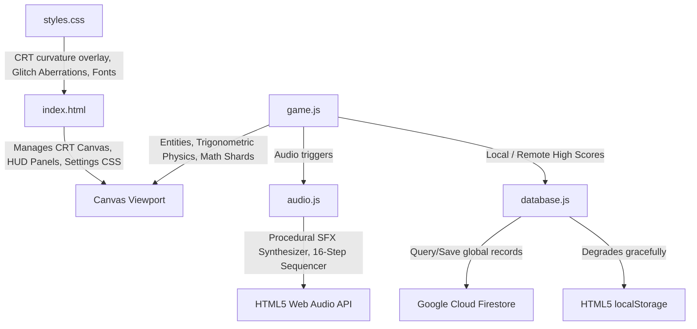

# 🛸 NEON STRIKER

[](https://alikahwaji.github.io/neon-striker/)
[](https://alikahwaji.github.io/neon-striker/)
[](https://alikahwaji.github.io/neon-striker/)
[](https://opensource.org/licenses/MIT)

**Neon Striker** is a premium, zero-dependency, serverless retro-synthwave space shooter arcade game built from the ground up utilizing pure HTML5 Canvas vector mathematics and the procedural Web Audio API synthesis engine. 

Pilot your high-performance cybernetic starfighter through **20 handcrafted cinematic, movie-themed sectors**, gather glowing nanotech scrap drops, purchase drone wingmen or active EMP shockwaves in the **Hangar Paint Shop**, and compete for the crown of the **Global Serverless Leaderboard**!

> 🕹️ **Play Live Immediately**: [https://alikahwaji.github.io/neon-striker/](https://alikahwaji.github.io/neon-striker/)

---

## ⚡ Core Pillars & Architectural Highlights

### 🖥️ 1. Retro CRT TV Monitor Emulation Suite
Neon Striker captures the visual warmth of 80s vector-display cabinet monitors through a zero-asset CSS/Canvas styling overlay:
*   **3D Curved Glass Bezel**: Toggled on in settings, this renders a sleek `8px` solid dark chassis border, chassis dropshadows, and curved canvas borders.
*   **Dynamic Scanline Drift**: Intersecting vertical and horizontal gradients simulate phosphor grid-lines, slowly shifting vertical sweep rollers to make the screen feel alive.
*   **Trauma-Based Screen Shaking**: High-intensity screen camera tremors triggered on damage, explosions, and EMP bursts.
*   **Chromatic aberration & System Glitches**: Severe shield collapse impacts trigger chromatic filter shifts and color rotations to amplify combat intensity.

### 🔊 2. Real-Time Procedural Sound Sequencing
The game runs a procedural sound synthesizer utilizing the **HTML5 Web Audio API**—meaning the game weighs less than **1MB** and requires **0% loading times** for music or effects:
*   **Procedural Effects**: Lasers, impact alarms, shield deflections, and structural collapses are synthesized in real-time mapping white noise buffers and oscillator frequency envelopes.
*   **Adaptive Sequencer**: A running 16-step musical sequencer automatically generates synthwave basslines and backing chords. The tempo, scale, and melody adapt dynamically to fit each sector theme (e.g., organ arpeggios for gargantua gravitational wells, mechanical drone patterns, and heavy metal synth arpeggios for Unicron).

### 🛠️ 3. Advanced Hangar Upgrade Shop & Customizer
Gather green **Nanotech Scrap (⚙️)** in battle and trade it in the modular Hangar shop between stages:
*   **🔥 Laser Cannon Tiers**: Cooldown upgrades evolve your blaster arrays:
    *   *Tier 1 (Dual Cyan)*: Parallel standard beams (Damage: 1.0)
    *   *Tier 2 (Sapphire)*: Thickened parallel bolts (Color: `#0088ff`, Damage: 1.3)
    *   *Tier 3 (Emerald)*: 3-Way spread blasters shooting at $\pm 12^\circ$ (Damage: 1.2 each)
    *   *Tier 4 (Ruby)*: Quad tight parallel railguns (Color: `#ff003c`, Damage: 1.4 each)
    *   *Tier 5 (Plasma)*: Massive piercing violet mega-beam bolt (Color: `#bd00ff`, Damage: 4.0)
*   **🛸 Orbiter Drone Escorts Wingman**: Trig-derived autonomous helper drones orbit your ship firing companion purple blasters.
*   **🌀 Active EMP Shockwave Module**: Clears all hostile bullet vectors in a `350px` expanding electric ring and stuns targets for `1.8s`.
*   **🧲 Scrap Magnet nanotech**: Vacuum green nanotech scrap credits from a wide attraction radius of `240px` automatically.
*   **🎨 Ship Paint Customizer**: Repaint your fighter dynamically in **Cyber Cyan**, **Toxic Acid**, **Solar Flare**, **Void Dust**, or **Glitch Rainbow** (dynamic HSL cycle).

### 🟢🔵🔴 4. Inclusive Difficulty Engine
*   **Cadet (Easy Mode)**: `200` max HP, `30%` slower enemy lasers, half gravitation pull, and checkpoint continues preserve scores with a `[CADET]` badge.
*   **Hero (Normal Mode)**: Standard balanced arcade shooter difficulty.
*   **Elite (Hard Mode)**: Starting shields locked at `100`, `25%` faster enemy lasers, rapid snipers, and **Permadeath** (continues disabled). Scores are rewarded with a prestigious global `[ELITE]` crown medal.

### 🌐 5. Serverless Leaderboard & Real-Time Telemetry
Built on top of the modular **Firebase Web SDK v12.13.0** loaded directly from CDNs:
*   **Dual-Redundancy**: If offline or credentials aren't set up, the database degrades gracefully to save and fetch high scores from browser `localStorage`.
*   **Firestore hall of fame**: Instantly query and display global leaderboard ratings, flagged with a globe (`🌐`) icon.
*   **Analytics Telemetry**: Automatically records session flow triggers (`game_start`, `level_start`, `purchase_upgrade`, `game_over`, `submit_score`) to map gameplay stats.
*   **Hardened security rules**: The Firebase Web SDK config (`apiKey`, `projectId`) is bundled into the public site — that's intentional, the Web SDK can't function without it. The real security boundary is [`firestore.rules`](firestore.rules), which restricts writes to strict shape validation (whitelisted fields, type/length checks, score range cap, server-timestamp enforcement) and blocks all updates/deletes. To deploy: paste the contents of `firestore.rules` into **Firebase Console → Firestore Database → Rules → Publish**.

---

## 🕹️ Control Mapping

| Keyboard Button | Action / System Trigger |
| :--- | :--- |
| **`W` / `A` / `S` / `D`** or **`↑` / `←` / `↓` / `→`** | Flight Movement (2D Thrusters) |
| **`SPACEBAR`** (Hold or Tap) | Discharge Primary Laser Cannons |
| **`E`** or **`SHIFT`** | Trigger Tactical EMP Shockwave *(Requires Hangar Unlock)* |
| **`P`** | Pause / Resume Arcade Simulation |

---

## 🛸 Retro Cheat Codes Console

In the **System Parameters (Settings)** menu, click the retro console input field to type hidden access codes:

1.  **`saucer`**: Transforms your vector ship outline into a rotating UFO Flying Saucer dome with spinning lights that fires glowing purple energy rings!
2.  **`rainbow`**: Automatically cycles your fired lasers through the entire HSL color wheel dynamically!
3.  **`god`**: Wraps your ship in an invincible white shield that absorbs all kinetic damage and floating text indicators!
4.  **`matrix`**: Overrides the grids of all levels into green falling Katakana rain columns!

---

## 🏗️ Codebase Architecture



---

## 🚀 Running Locally

Because Neon Striker is serverless and zero-dependency, you don't need to run any heavy build pipelines to play:

1.  **Clone the Repository**:
    ```bash
    git clone https://github.com/alikahwaji/neon-striker.git
    cd neon-striker
    ```
2.  **Launch directly**:
    Simply double-click [index.html](index.html) in your browser!
3.  *(Optional)* **Local server dev**:
    If you wish to serve the directory locally, run a lightweight static web server:
    ```bash
    npx -y http-server ./
    ```
    And visit the local loopback link at `http://localhost:8080/`.

---

## 🛠️ Building (after editing gameplay source)

The gameplay scripts (`audio.js`, `config.js`, `entities.js`, `render.js`, `collisions.js`, `achievements.js`, `stats.js`, `main.js`, `ui.js`) are concatenated into a single **`game.bundle.js`** wrapped in one IIFE. This keeps game state (`scrapCredits`, `score`, etc.) inside a private scope so it can't be trivially edited from the browser DevTools console — a lightweight **anti-cheat deterrent**. `index.html` loads `game.bundle.js`, not the individual files.

After editing any source file, regenerate the bundle:

```bash
node build.js        # or: npm run build
```

A CI check (`.github/workflows/bundle-check.yml`) fails any PR where `game.bundle.js` is out of date with its sources, so a stale bundle can't reach production. `database.js` is intentionally **not** bundled — it stays an ES module so its Firebase config + `window.*` leaderboard bridge load independently.

> **Note:** this is a deterrent, not true anti-cheat. Because the game is 100% client-side, a determined user can still tamper via Sources-panel breakpoints. Leaderboard integrity is additionally enforced server-side by [`firestore.rules`](firestore.rules) (score cap + shape validation). True tamper-proof scoring would require server-authoritative validation (a Cloud Function).

---

## 📜 MIT License
Distributed under the MIT License. See [LICENSE](LICENSE) for more information.
